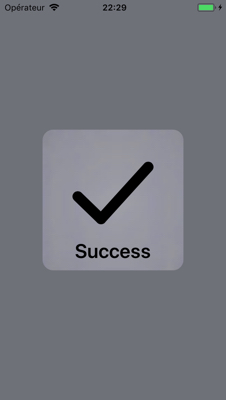
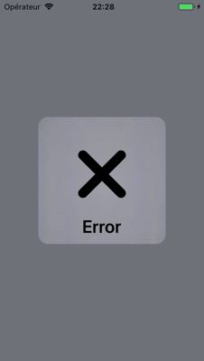

<h1 align="center"> Success and Error Status </h1>
<p align="center">


</a>
</p>

A modal status view which look and feel like Xcode build succeeded status view. Very simple to use and customise.


### Features
- [x] Look and feel like Xcode Build Succeeded status with appearance animation.
- [x] Easy presentation.
- [x] Automatic disappearance.
- [x] Swift 4+.

<div align = "center">


</div>

## Usage

- To Present

```swift
// default success status
ModalStatusPresenter.presentStatus()
// or for more options
ModalStatusPresenter.presentStatus(frame: CGRect, title: String, type: StatusType, signColor: CGColor, textColor: UIColor)
```
## Installing

#### Manually

Download and add `ModalStatus.swift` file in your project. 
Or create a new file in your project and paste the code of `ModalStatus.swift`.

## Requirements

* Swift 4+
* iOS 11 or higher

## Authors

* **Jahid Hasan Polash** -  [jahid-hasan-polash](https://github.com/jahid-hasan-polash)

## Communication

* If you **found a bug**, open an issue.
* If you **have a feature request**, open an issue.
* If you **want to contribute**, submit a pull request.

## License

This project is licensed under the MIT License.
